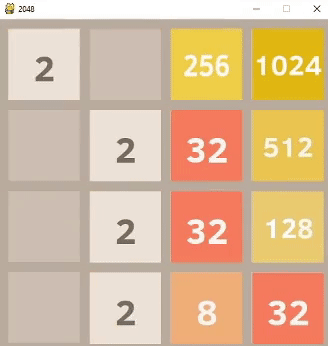
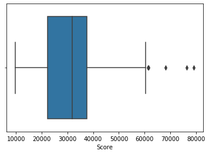

# 2048-AI
2048 game AI using pygame and expectimax algorithm

## How it works
The AI uses a variation of the mini-max algorithm, known as the expectimax algorithm, which takes into account the probability of any given event.
For each move, it evaluates the probability of every possible board after the move, and its score. More about the scoring heuristics used can be found below.
The score of each board and the probability of each board occuring are then multiplied together and the move with the highest sum is selected. 
This is done up to 3 moves ahead of the current board.  

More information about the expectimax algorithm can be found here: http://www.cs.rpi.edu/~xial/Teaching/2018S/slides/IntroAI_7.pdf

### Scoring Heuristic

* The score of each board is evaluated by a few heuristics. 
* Firstly, the motonicity of the board. A higher score is given when the board increases or decreases only in one direction.
* Secondly, the number of potential merges a board can have. This was measured in the down and right directions, to avoid double counting.
* Lastly, the actual score of the game and the number of empty spaces.

Details on the code for evaluation can be found in evaluation_functions.py. 

## Analysis of AI performance
The AI did surprisingly well for my expectations given that this was my first coding project.
Analysis was done using pandas and seaborn, after running the AI 100 times and collecting the results.

Max Tile| Percentage
--- | --- 
512| 100%
1024| 99%
2048| 76%
4096| 11%

The AI acheieved the 2048 tile 76% of the time.

As for scoring the results are as follows:

Median: 31804

Minimum: 9684

Maximum: 79212

First quartile: 22280

Third quartile: 37703

Interquartile Range: 15423

Outliers: 79212 76516 68128 61456 61324

## Potential Improvements

The AI acheives the goal of the 2048 tile 76% of the time. It could potentially be improved especially in terms of computational performance. A transposition table along with memoisation
that stores all the board states it has previously evaluated would reduce redundant calculations and enable the AI to look even more moves ahead. There could also be ways to adjust the weights 
of the scoring heuristics to improve its performance, by using methods such as gradient descent commonly used in neural networks. 
